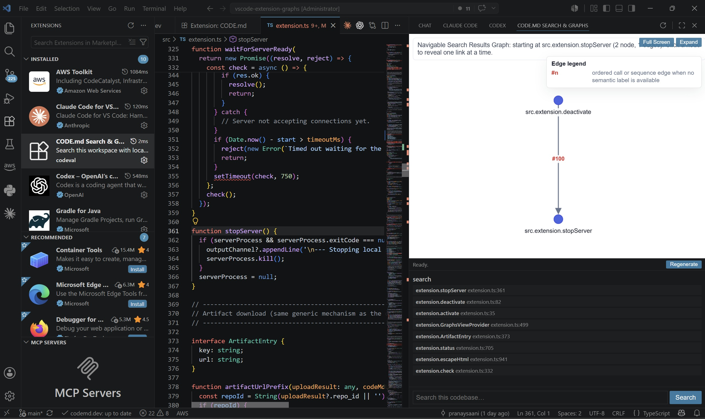

# CODE.md

Install the extension and your coding agent (Claude, Codex, Cursor, etc.) gets smarter — and you save tokens, time, and $.

Estimate only — save up to 15% or 20% of your token size and budget per month

Estimate only - High Impact teams that use agents heavily, use large models (GPT4, Claude 3.5, etc.), have long reasoning chains, generate multi-file changes could potentially save 15% to 20% of their monthly token budget. This can potentially translate to hundreds of dollars per month from this single CODE.md vscode extension!

CODE.md analyzes your workspace locally and generates a compact, structured map of your codebase: call graphs, file dependencies, UI element graphs, and repo stats. Point your coding agent at the generated `CODE.md` and it can answer "where is X" or "what calls Y" from a few KB of structured facts instead of grepping and reading through your entire repo.

## Features

### 🔍 Search
Search your codebase from the sidebar panel — results are pulled from the local structural analysis, not just plain text grep, so you get matches with file, line, and context.

### 🕸️ Search Graphs
Browse interactive, navigable graphs of your codebase directly inside VS Code:

- **Call graph** — who calls what, across languages
- **File graph** — file-to-file dependencies
- **HTML UI graph** — buttons, links, inputs, and forms in your frontend

Open a graph in the side panel, expand it to fill the window, or pop it out into a full editor tab.

## Getting Started

1. Install the extension.
2. Click the CODE.md icon in the Activity Bar.
3. Run **Generate CODE.md** to analyze the current workspace.
4. Use the **Search** box to query your codebase, or open the generated graphs to explore visually.
5. Point your coding agent's context (e.g. `AGENTS.md` / `CLAUDE.md`) at the generated `codemd.dev/` folder so it can use the structured graphs instead of re-reading the whole repo.

## Requirements

- Python 3 (the extension manages an isolated virtual environment automatically; you can also set `codemdGraphs.pythonPath` to use your own interpreter).

## Learn More

Visit [codemd.dev](https://www.codemd.dev) for more details.
